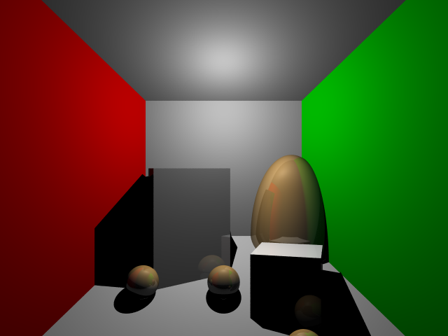
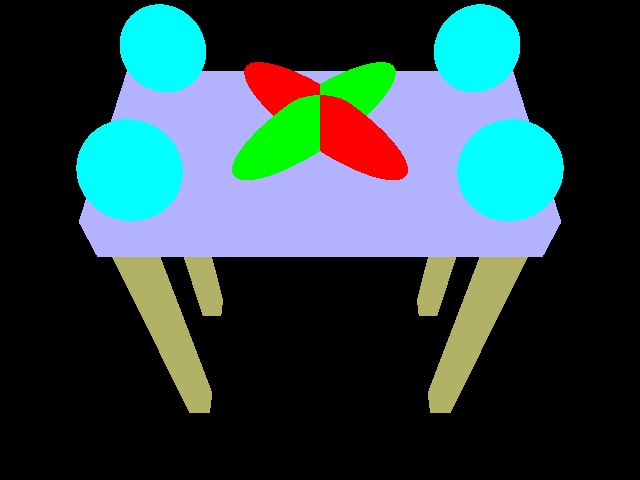
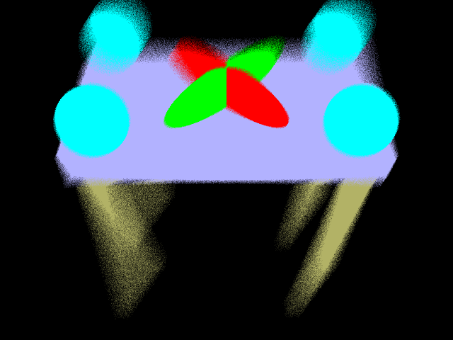

# CSE 168 HW additional features
## Pixel Antialiasing
- For antialiasing, I generate 100 rays per pixel, and then get the average color.
- Below is the comparation of graphs before and after pixel antialiasing:

- And we can see the difference of edge pixels for objects.
- It is obvious that after pixel antialiasing, the edge looks more continuous

## Depth of Field
- For depth of field, I set the aperture be 1 and the focal length be 5
- First calculate the focal point on the focal plane, then take some offset of the origin of ray (ray not shoot from a single point, but shoot from random point on the aperture)
- I generate 10 rays per pixel, each from a random point on the aperture.
- Then calculate the new ray direction according to the focal point and the new ray origin.
- Below is the comparation of graphs before and after do depth of field:

- we can see the part not on the focal plane is not very clear
