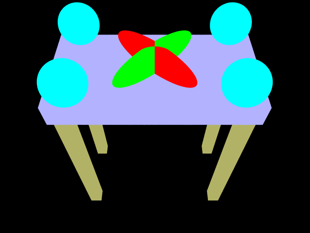

# CSE 168 HW additional features
## pixel antialiasing
- For antialiasing, I generate 100 rays per pixel, and then get the average color.
- Below is the comparation of graphs before and after pixel antialiasing:

- It may not very clear, let's zoom in part of them:

- And we can see the difference of edge pixels for object.
- It is obvious that after pixel antialiasing, the edge is softer.
